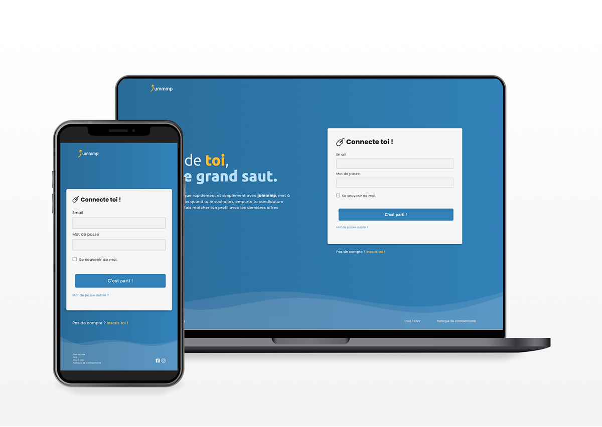
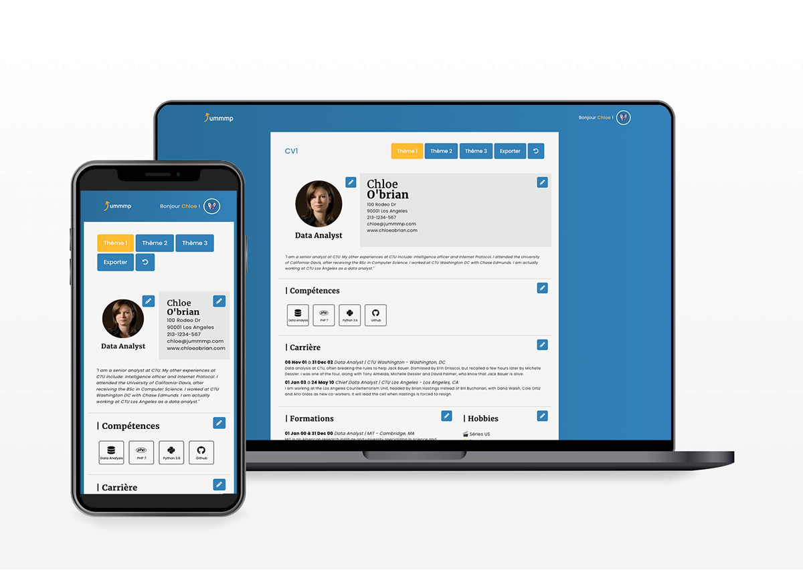

# **`Jummmp - "Make Postuler Great Again"`**

## **`🌍 Contexte :`**

Ce projet intervient dans le cadre de la formation Développeur Web & Mobile **`WebForce3`** et constitue l'application web délivrée lors de la soutenance pour la certification CNCP Techniques d'Intégrations Web & Techniques de Développement Web.

Il a été réalisé du 06 au 18 avril 2021 par Swann **Martin**, Michael **Krysztofiak** & Thomas **Barnabé**.

## **`🚀 Objectif :`**

Développer une application web capable de générer des curriculum vitae numériques. 

Après avoir créé son compte, l'utilisateur pourra éditer son curriculum vitae en complètant son profil et les différentes sections du document. Il aura également la possibilité d'éditer gratuitement jusqu'à 3 documents différents, pour autant de candidatures différentes.

Les données de l'utilisateur persisteront sur une base données, lui offrant la possibilité de sauvegarder et de modifier son profil au besoin.

L'utilisateur pourra ensuite générer un short URL de son curriculum vitae, afin de le partager de manière dématérialisée.

`Développements complémentaires: `
- Comparer les mots clés du CV avec les offres d'emploi actuelles.
- Envoyer un email sponsorisé et mis en page vers les recruteurs.
- Exporte au format PDF et imprimer.

#

  
  

## **`🔒 Contraintes techniques :`**
- Framework imposé: Symfony.
- Architecture imposé: POO/ MVC.
- Utilisation d'un SGBD.
- Appel à une API et/ ou requête AJAX.
- Responsive Web Design.
- W3C/ RGGA/ SEO.  
 
 #

| **`🔗 Let's connect`** |                                                                                                                                                                                |
| ----------------------- | ------------------------------------------------------------------------------------------------------------------------------------------------------------------------------ |
| Swann **Martin** |  |
| Michael **Krysztofiak** |  |
| Thomas **Barnabé** |  |
