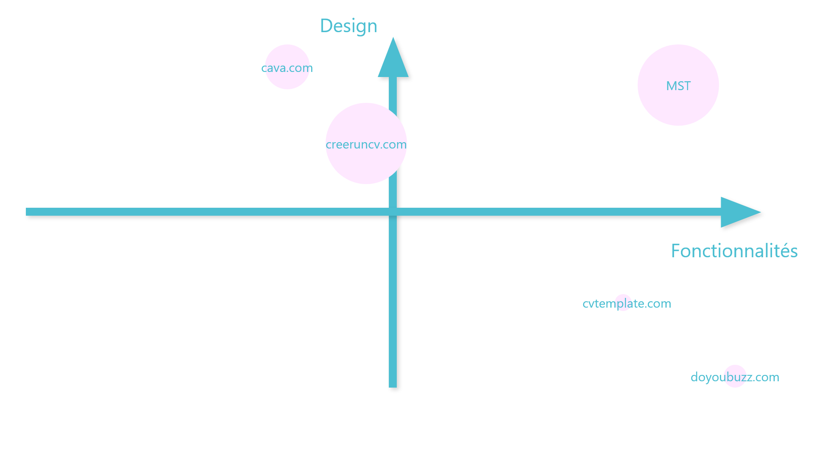
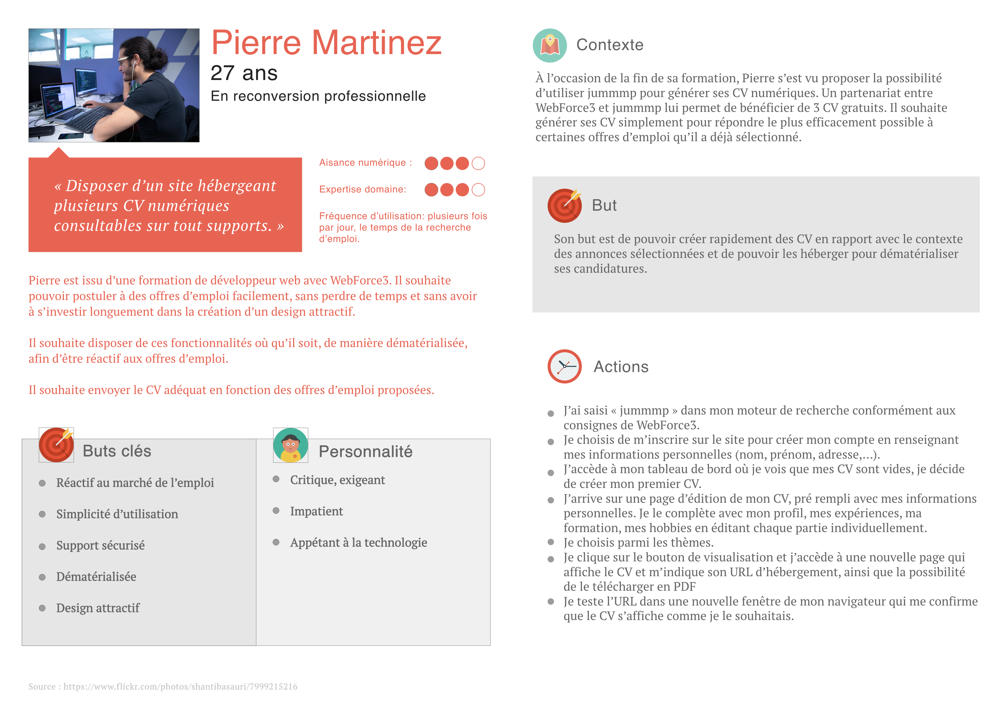
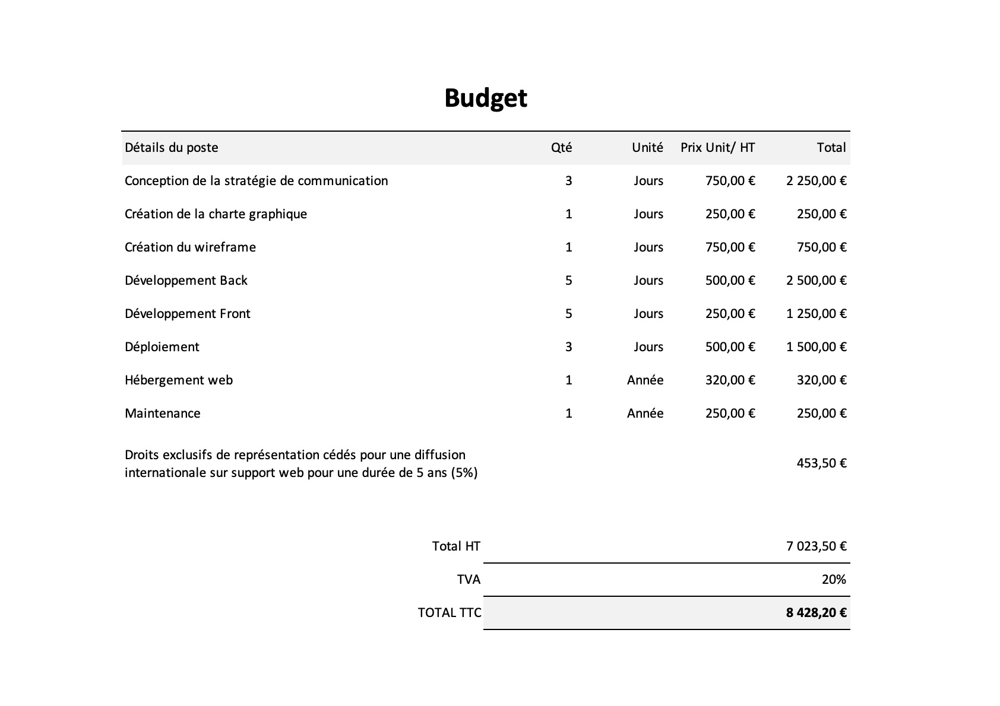
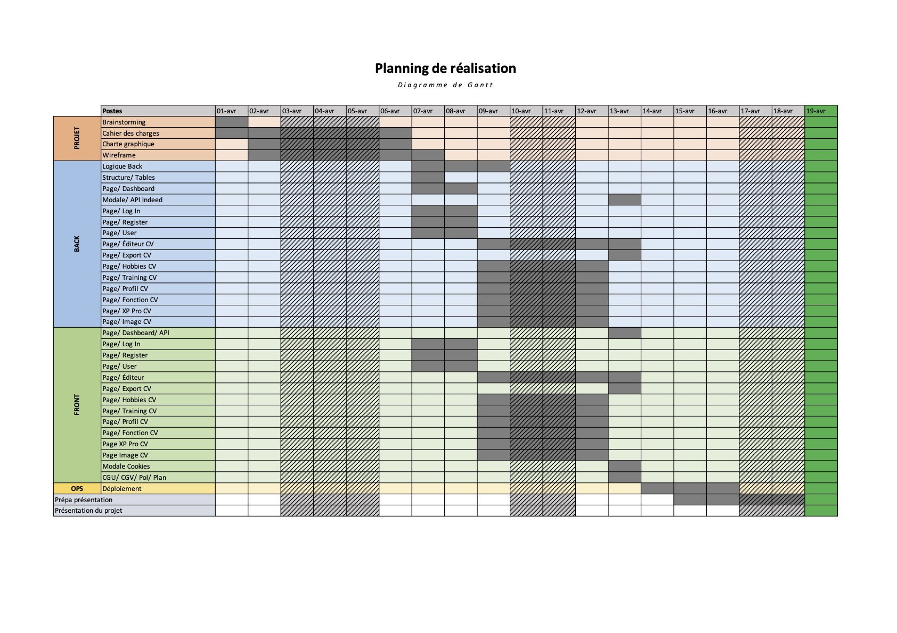
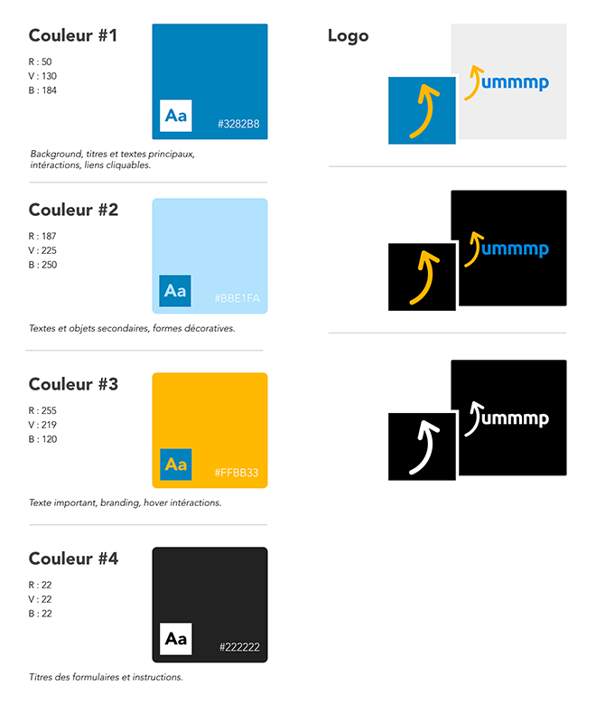
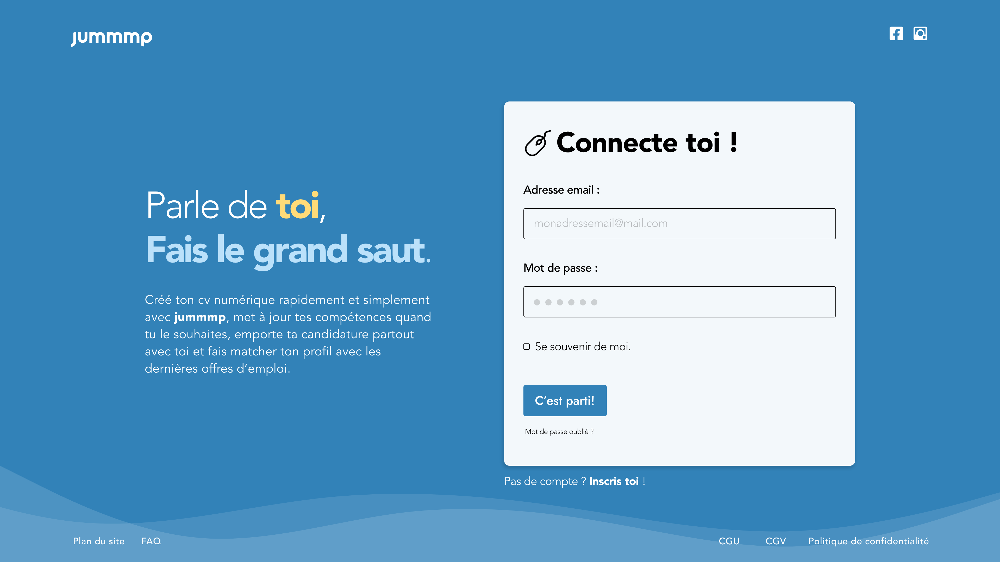
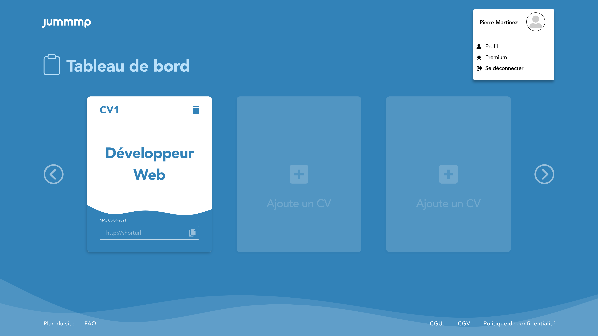
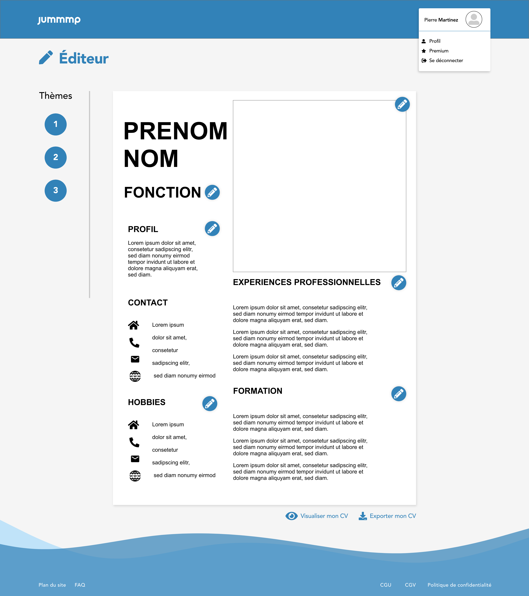

# **`Jummmp - Cahier des charges`**

1.  Contextualisation
2.  Problématique de communication
3.  Stratégie de communication
4.  Stratégie créative
5.  Stratégie des moyens
6.  Budget
7.  Planning de réalisation
8.  Structure

# `1. Contextualisation`

## **Concept**

L'agence web SMT, spécialisée dans le développement de sites et applications web a été mandatée par le client Web Force 3 pour développer un générateur de CVs en ligne.

Web Force 3 est un organisme spécialisé dans la formation de développeurs web. Les élèves issus de cette formation ne disposent pas tous de CVs numériques pour démontrer leurs compétences et postuler aux offres d'emploi de manière simple et pertinante. L'objectif est de mettre à leur disposition une application où ils disposeront de templates de CVs personnalisables, hébergés et dématerialisés pour postuler efficacement aux offres d'emploi.

Après s'être connecté sur l'application Jummmp, l'utilisateur aura la possibilité de saisir ses informations personnelles (identité, compétences, formations, expériences, hobbies...). Ces informations persisteront sur une base de données sécurisée. Elles permettront de générer 3 propositions de CVs qui seront accessibles via un short-url ou un QR-Code.

> Développement complémentaires :

- Vérifier la corrélation via webScrapping.
- Comparer les mots clés du CV avec les offres d'emploi actuelles.
- Fonctionnalité d'envoi de mail sponsorisé et mis en page.
- Cv exportable en PDF et imprimable.

## **Présentation de la concurrence**

[Canva](https://www.canva.com/fr_fr/cv/modeles/) : création et design de CV, touche un public plutôt jeune (CSP +). Propositions intéressantes pour la personnalisation du design. Plusieurs éléments gratuits, mais devient rapidement payant lorsqu'on souhaite plus de choix.

[cvTemplate](https://www.cv-template.com/fr) : création de CV en ligne : design limités, prix premium pour hébergement.

[doYouBuzz](https://www.doyoubuzz.com/fr/) : création et partage de CV sur le web directement en pdf, attractif mais pas de dématérialisation.

[creeruncv](https://www.creeruncv.com/) : création de CV , gratuit, variété de templates attractifs, pas d'hébergement.

Notre différenciation : prix, designs, données hebergées, candidature dématerialisée.

> Idées de nom de site : weResumeyouWork, MyBestCV, ResumeMe, HelloCV, HiCV, HiResume, Jummmp.

## **Mapping de la concurrence**

## **Analyse SWOT**

| Force / Strength         | Faiblesse / Weakness                 |
| ------------------------ | ------------------------------------ |
| Design graphique moderne | Hébergement limité                   |
| Approche UX              | Templates limités                    |
| Simplicité d'utilisation | Contrainte de temps                  |
| Hébérgement              | Connexion moteur de recherche limité |
| Prix attractif (gratuit) |                                      |

| Opportunités / Opportunities                          | Menaces / Threats                                        |
| ----------------------------------------------------- | -------------------------------------------------------- |
| Tendance à la dématérialisation des données           | Secteur concurrentiel                                    |
| Accès à distance aux données pour modification rapide | Plus de personnalisation chez concurrents                |
| Simplicité d'utilisation                              | Sécurisation des données                                 |
| Offre complète, prix, hébergement, clé en main        | Tarif des hébergeurs potentiellement dangereux pour nous |
|                                                       |                                                          |

# `2. Problématique de communication`

## **Synthèse**

Nos analyses ont permis de démontrer que les concurrents principaux ne proposent pas d'offres permettant à la fois un hébergement de CVs en ligne et des designs originaux à un prix attractif.

Comment faire connaître une application web pour qu'il puisse permettre aux demandeurs d'emploi d'héberger en ligne, des CV qui soient attractifs pour les recruteurs ?

# `3. Stratégie de communication`

## **Positionnement**

Key words : attractif, accessible, simple, cloud.

## **Objectifs**

**Cognitif:**
Développer la notoriété du site auprès des développeurs en recherche d'emploi. En parler aux élèves de chaque session WF3 / conseillers Pôle Emploi.

**Affectif:**
Simple d'utilisation : design épuré, approche UX.
Sécurisé : choix du langage PHP et d'un framework optimisé pour la sécurité.
Fiable : choix du PHP et d'un framework optimisé pour la sécurité.

**Cognatif:**
Un template gratuit disponible. 3 templates gratuits disponibles pour les étudiants WebForce3.

## **Cibles**

**Cible principale :**
Toute personne en recherche d'emploi, désireuse d'utiliser des solutions dématérialisées pour répondre aux offres efficacement. Solution facile et clé en main avec un design de CV fourni créé par un graphiste.

**Coeur de cible :**

Les développeurs web en sortie de formation ou en recherche d'emploi, désireux de postuler rapidement aux offres d'emploi.

**Cible secondaire :**
Les recruteurs qui peuvent facilement consulter des viviers de CVs en ligne.

# `4. Stratégie créative`

## **Promesses, preuves, tons et contraintes**

**Notre promesse :** Postuler Made Great Again ! Jummmp vous permet de postuler facilement aux offres d'emploi à l'aide de CVs dématérialisés et personnalisables.

**Preuve :** La plateforme permettra en quelques clics d'accéder à au moins 1 template de CV, de le personnaliser et de le poster aux recruteurs.

**Ton :** Le coeur de cible étant les développeurs web, nous avons déterminé qu'il était préférable d'adopter un ton smart-casual, dynamique, cordial, libre mais respectueux, un tutoiement poli.

**Contraintes :** La conservation des données, par l'utilisation de technologies sûres, devra se conformer aux contraintes de la législation (RGPD) et d'accessibilité (RGAA & SEO), le choix du serveur pour la scallabilité et un nombre croissant d'utilisateurs.

# `5. Stratégie des moyens`

| Col1                               | Col2                        | Col3                                                                                                                                                               |
| ---------------------------------- | --------------------------- | ------------------------------------------------------------------------------------------------------------------------------------------------------------------ |
| **Structure web**                  | 15 pages                    | connexion, inscription, dashboard, interfaces (fonction, image, xp pro, formation, hobbies), profil, visualisation (URL + PDF), RGPD, FAQ, CGV, CGU, plan du site. |
| **Base de données**                | Table User                  | id, email, lastName, firstName, avatar, streetAdress, postCode, city, phone, website, password.                                                                    |
| **Base de données**                | Table Xp                    | id, jobDateFrom, jobDateTo, jobName, companyName, jobLocation, jobDescritpion, foreign key userId                                                                  |
| **Base de données**                | Table CV                    | id, model, title, function, about, createdAt, updatedAt, shortUrl, foreign key userId                                                                              |
| **Base de données**                | Table Training              | id, trainingDateFrom, trainingDateTo, diplomaName, schoolName, schoolLocation, diplomaDescritpion, foreign key userId                                              |
| **Base de données**                | Table Hobbies               | id, icons, hobbiesName, foreign key userId                                                                                                                         |
| **Base de données**                | Table Skills                | id, icons, skillName, foreign key userId                                                                                                                           |
| **Hébergement**                    | Sécurisé                    | Serveur (Apache) Heroku, Symfony Cloud, platform SH, Php, MySql / MariaDB                                                                                          |
| **Référencement et accessibilité** | Google friendly, SEO - RGAA | Lightouse et respect des règles Opquast.                                                                                                                           |

# `6. Budget`

# `7. Planning de réalisation`

# `8. Structure`

## **Identité visuelle**

## **Wireframe**

### Page - Log In

### Page - Dashboard

### Page - Éditeur

## 

# **`Let's connect 🔗`**

| L'agence SMT   |                                                                                                                                                                                |
| ----------------------- | ------------------------------------------------------------------------------------------------------------------------------------------------------------------------------ |
| Swann **Martin** |  |
| Michael **Krysztofiak** |  |
| Thomas **Barnabé** |  |
